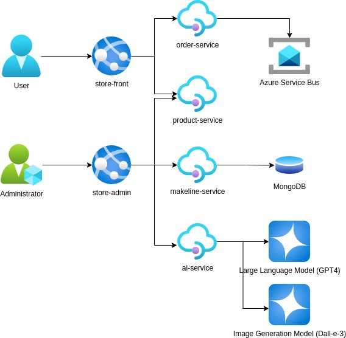

# CST8915 Assignment 2 Best Buy Website

## Updated Application Architecture



## Application and Architecture Explanation

### 1. **User Interaction**

- **User**: Interacts with the system through the `store-front` service.
- **store-front Service**: Acts as the front-end service, allowing users to browse products and place orders.
- **order-service**: Handles user orders and communicates asynchronously using Azure Service Bus.
- **product-service**: Provides product information to the user.

### 2. **Administrator Interaction**

- **Administrator**: Manages the application via the `store-admin` service.
- **store-admin Service**: Enables administrators to perform tasks like adding products or managing orders.
- **makeline-service**: Processes backend operations and stores data in the MongoDB database.

### 3. **AI Services**

- **AI Service (ai-service)**: Connects to a Large Language Model (GPT-4) and an Image Generation Model (DALL-E 3) to provide intelligent interactions and image generation capabilities.

### 4. **Technology Stack and Data Flow**

- **Azure Service Bus**: Facilitates asynchronous communication between services, particularly for order handling.
- **MongoDB**: Serves as the central database for storing persistent data such as products and orders.
- **Microservices Architecture**: Each service is independently deployed, making the system modular, scalable, and easy to maintain. Services communicate through HTTP or message queues.

### **Workflow**

1. Users interact with the system via the `store-front` service to browse products and place orders.
2. The `store-front` service calls the `order-service` to process orders, with Azure Service Bus handling asynchronous messaging.
3. The `product-service` provides product-related data to the users.
4. Administrators use the `store-admin` service to manage products and orders, which in turn calls the `makeline-service` to update the MongoDB database.
5. The `ai-service` supports advanced features like answering queries using GPT-4 or generating images through DALL-E 3.

## Deployment Instructions

- Create and Deploy the Secret for OpenAI API:

  - Make sure that you have replaced Base64-encoded-API-KEY in secrets.yaml with your Base64-encoded OpenAI API key.

  ```
  kubectl apply -f secrets.yaml
  ```

- Deploy the Application

  ```
  kubectl apply -f aps-all-in-one.yaml
  ```

  ```
  kubectl get services
  ```

  - Access the Store Front app at the external IP on port 80.
  - Access the Store Admin app at the external IP on port 80.

- Deploy Virtual Customer and Worker

  ```
  kubectl apply -f admin-tasks.yaml
  ```

## Table of Microservice Repositories

| **Service**      | **Docker Image Link**                                    |
| ---------------- | -------------------------------------------------------- |
| Store-Front      | `https://github.com/gundami/CST8915-store-front-L8`      |
| Order-Service    | `https://github.com/gundami/CST8915-order-service-L8`    |
| Store-Admin      | `https://github.com/gundami/CST8915-store-admin-L8`      |
| Product-Service  | `https://github.com/gundami/CST8915-product-service-L8`  |
| Virtual-Worker   | `https://github.com/gundami/CST8915-virtual-worker-L8`   |
| Virtual-Customer | `https://github.com/gundami/CST8915-virtual-customer-L8` |
| Ai-Service       | `https://github.com/gundami/CST8915-ai-service-L8`       |
| Makeline-Service | `https://github.com/gundami/CST8915-makeline-service-L8` |

## Table of Docker Images

| **Service**      | **Docker Image Link**                                        |
| ---------------- | ------------------------------------------------------------ |
| Store-Front      | `https://hub.docker.com/repository/docker/gundami0096/store-admin-as2` |
| Order-Service    | `https://hub.docker.com/repository/docker/gundami0096/order-service-as2` |
| Store-Admin      | `https://hub.docker.com/repository/docker/gundami0096/store-admin-as2` |
| Product-Service  | `https://hub.docker.com/repository/docker/gundami0096/product-service-as2` |
| Virtual-Worker   | `https://hub.docker.com/repository/docker/gundami0096/virtual-worker-as2` |
| Virtual-Customer | `https://hub.docker.com/repository/docker/gundami0096/virtual-customer-as2` |
| Ai-Service       | `https://hub.docker.com/repository/docker/gundami0096/ai-service-as2` |
| Makeline-Service | `https://hub.docker.com/repository/docker/gundami0096/makeline-service-as2` |

## Demo Video

https://youtu.be/u0z-1UT5_sw
